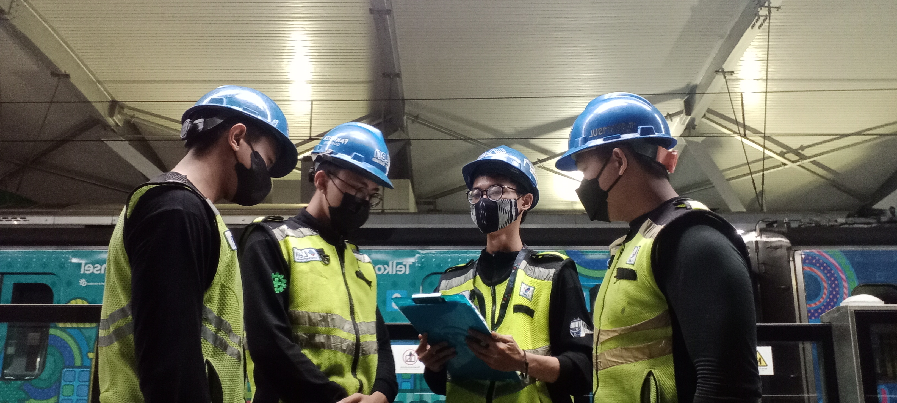
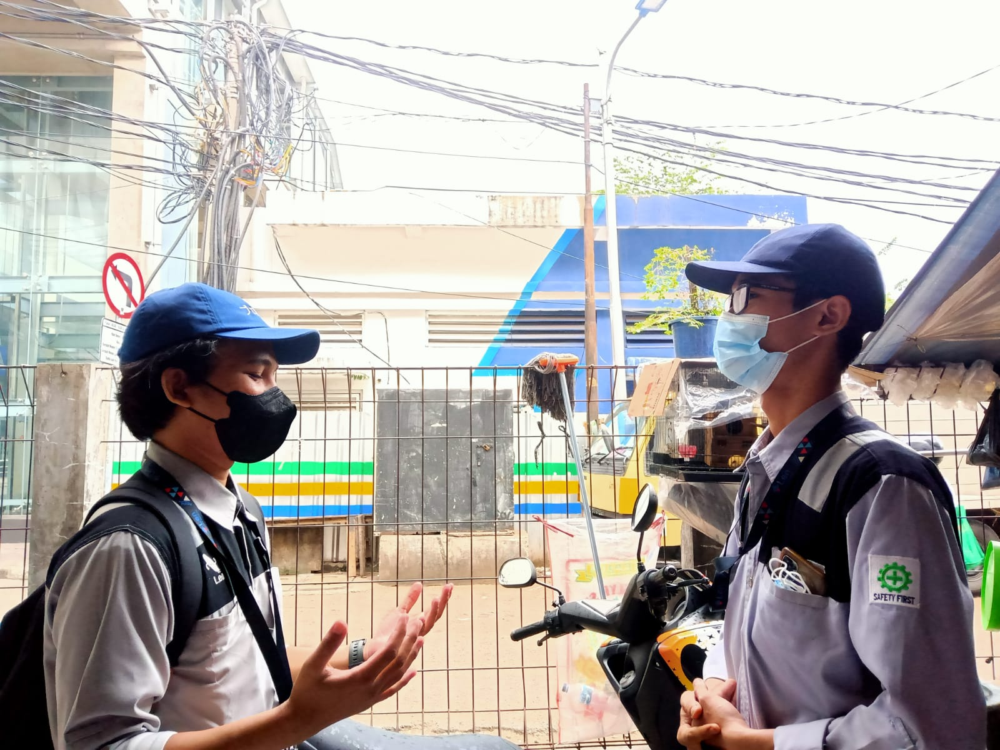
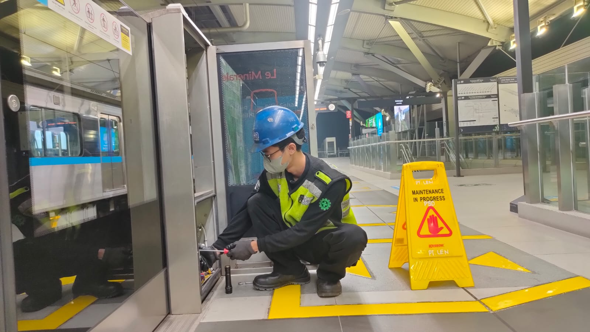
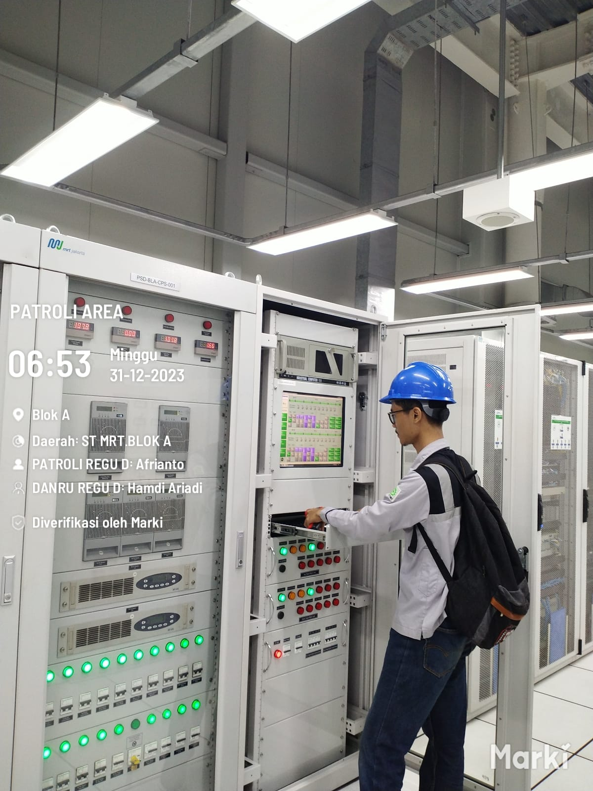
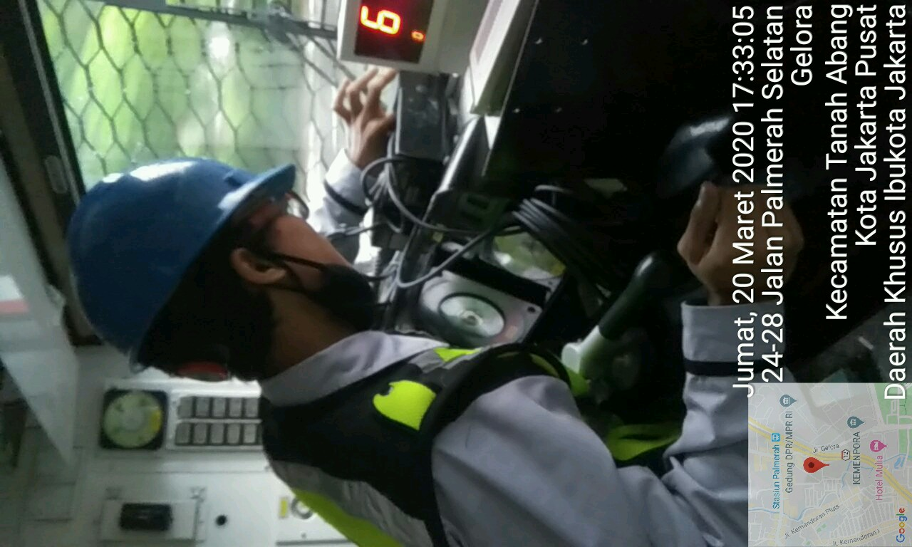

<!-- # cvHendro
<!DOCTYPE html> -->
<html lang="en-US">
  <head>
    <meta charset="UTF-8">
    <meta http-equiv="X-UA-Compatible" content="IE=edge">
    <meta name="viewport" content="width=device-width, initial-scale=1">
    <title>Curriculum Vitae  HENDRO</title>
    <meta name="description" content="Creative CV is a HTML resume template for professionals. Built with Bootstrap 4, Now UI Kit and FontAwesome, this modern and responsive design template is perfect to showcase your portfolio, skils and experience."/>
    <link href="https://fonts.googleapis.com/css?family=Montserrat:400,700,200" rel="stylesheet">
    <link href="https://maxcdn.bootstrapcdn.com/font-awesome/latest/css/font-awesome.min.css" rel="stylesheet">
    <link href="css/aos.css" rel="stylesheet">
    <link href="css/bootstrap.min.css" rel="stylesheet">
    <link href="styles/main.css" rel="stylesheet">
  </head>
  <body id="top">
    <header>
      

        <nav class="navbar navbar-expand-lg fixed-top navbar-transparent bg-primary" color-on-scroll="400">
          

            
<a class="navbar-brand" href="#" rel="tooltip">CURICULUM VITAE</a>
              <button class="navbar-toggler navbar-toggler" type="button" data-toggle="collapse" data-target="#navigation" aria-controls="navigation" aria-expanded="false" aria-label="Toggle navigation"></button>
            

            

              <ul class="navbar-nav">
                <li class="nav-item"><a class="nav-link smooth-scroll" href="#about">About</a></li>
                <li class="nav-item"><a class="nav-link smooth-scroll" href="#skill">Skills</a></li>
                <li class="nav-item"><a class="nav-link smooth-scroll" href="#portfolio">Portfolio</a></li>
                <li class="nav-item"><a class="nav-link smooth-scroll" href="#experience">Experience</a></li>
                <li class="nav-item"><a class="nav-link smooth-scroll" href="#contact">Contact</a></li>
              </ul>
            

          

        </nav>
      

    </header>
    

      

  

    

      

      

        

          

          
HENDRO SYAHPUTRO

          
ELECTRO ENGINEERING, WEB DEVELOPER
<a class="btn btn-primary smooth-scroll mr-2" href="https://www.linkedin.com/in/hendro-syahputro-ba59b320b?utm_source=share&utm_campaign=share_via&utm_content=profile&utm_medium=android_app" data-aos="zoom-in" data-aos-anchor="data-aos-anchor">Hire Me</a><a class="btn btn-primary" href="#contact" data-aos="zoom-in" data-aos-anchor="data-aos-anchor">Contact me</a>
        

      

      

        

          
<a class="btn btn-default btn-round btn-lg btn-icon" href="https://www.facebook.com/share/19LqQ7NNuk/" rel="tooltip" title="Follow me on Facebook"><i class="fa fa-facebook"></i></a><a class="btn btn-default btn-round btn-lg btn-icon" href="https://www.linkedin.com/in/hendro-syahputro-ba59b320b?utm_source=share&utm_campaign=share_via&utm_content=profile&utm_medium=android_app" rel="tooltip" title="Follow me on LinkedIn"><i class="fa fa-linkedin"></i></a><a class="btn btn-default btn-round btn-lg btn-icon" href="#" rel="tooltip" title="Follow me on Google+"><i class="fa fa-google-plus"></i></a><a class="btn btn-default btn-round btn-lg btn-icon" href="https://www.instagram.com/30hndro?igsh=MWlxdHQwZ3VwZjBx" rel="tooltip" title="Follow me on Instagram"><i class="fa fa-instagram"></i></a>

        

      

    

  

  

    

      

        

          

            
About

            
May I present my name is Hendro Syahputro. I am very happy with my work as an electronics technician, and I am able to adjust my position regardless of where I work 

            
 <a href="https://hendro3.github.io/cvHendro/#" target="_blank">Learn More</a>

          

        

        

          

            
Basic Information

            

              
<strong class="text-uppercase">Age:</strong>

              
23

            

            

              
<strong class="text-uppercase">Email:</strong>

              
hendrosyahputro30102000@gmail.com

            

            

              
<strong class="text-uppercase">Phone:</strong>

              
+62 857-1496-5149

            

            

              
<strong class="text-uppercase">Address:</strong>

              
Jalan Al Amanah Wijaya Kusuma, Grogol Petamburan, Jakarta Barat

            

            

              
<strong class="text-uppercase">Language:</strong>

              
English, Indonesian 

            

          

        

      

    

  

  

    
Professional Skills

    

      

        

          

            
HTML
              

                

80%
              

            

          

          

            
CSS
              

                

75%
              

            

          

        

        

          

            
JavaScript
              

                

60%
              

            

          

          

            
Mechanical, Electrical Platform Screen Door
              

                

60%
              

            

          

        

        

          

            
Bootstrap
              

                

75%
              

            

          

          

            
Basic Electro
              

                

90%
              

            

          

        

      

    

  

  

    

      

        
Portfolio

        

          <ul class="nav nav-pills nav-pills-primary" role="tablist">
            <li class="nav-item"><a class="nav-link active" data-toggle="tab" href="#PTLEN" role="tablist"><i class="fa fa-laptop" aria-hidden="true"></i></a></li>
            <li class="nav-item"><a class="nav-link" data-toggle="tab" href="#graphic-design" role="tablist"><i class="fa fa-picture-o" aria-hidden="true"></i></a></li>
            <li class="nav-item"><a class="nav-link" data-toggle="tab" href="#Photography" role="tablist"><i class="fa fa-camera" aria-hidden="true"></i></a></li>
          </ul>
        

      

    

    

      

        

          

            

              
<a href="#PTLEN">
                  <figure class="cc-effect">
                    <figcaption>
                      
Toolbox meeting in team leader

                      
Project PSD MRT Jakarta

                    </figcaption>
                  </figure></a>

              
<a href="#PTLEN">
                  <figure class="cc-effect">
                    <figcaption>
                      
Toolbox meeting in team leader

                      
Project PSD MRT Jakarta

                    </figcaption>
                  </figure></a>

            

            

              
<a href="#PTLEN">
                  <figure class="cc-effect">
                    <figcaption>
                      
Preventif maintenance PSD MRT Jakarta

                      
Project PSD MRT Jakarta

                    </figcaption>
                  </figure></a>

              
<a href="#PTLEN">
                  <figure class="cc-effect">
                    <figcaption>
                      
Monitoring PSD at operational hours

                      
Project PSD MRT Jakarta

                    </figcaption>
                  </figure></a>

              
<a href="#PTLEN">
                    <figure class="cc-effect">
                      <figcaption>
                        
Monitoring Radio cabin KAI Commuter at operational hours

                        
Project Radio cabin KAI Commuter

                      </figcaption>
                    </figure></a>

            

          

        

      

      

        

          

            

              
<a href="#graphic-design">
                  <figure class="cc-effect">
                    <figcaption>
                      
Triangle Pattern

                      
Graphic Design

                    </figcaption>
                  </figure></a>

              
<a href="#graphic-design">
                  <figure class="cc-effect">
                    <figcaption>
                      
Abstract Umbrella

                      
Graphic Design

                    </figcaption>
                  </figure></a>

            

            

              
<a href="#graphic-design">
                  <figure class="cc-effect">
                    <figcaption>
                      
Cube Surface Texture

                      
Graphic Design

                    </figcaption>
                  </figure></a>

              
<a href="#graphic-design">
                  <figure class="cc-effect">
                    <figcaption>
                      
Abstract Line

                      
Graphic Design

                    </figcaption>
                  </figure></a>

            

          

        

      

      

        

          

            

              
<a href="#Photography">
                  <figure class="cc-effect">
                    <figcaption>
                      
Photoshoot

                      
Photography

                    </figcaption>
                  </figure></a>

              
<a href="#Photography">
                  <figure class="cc-effect">
                    <figcaption>
                      
Wedding Photoshoot

                      
Photography

                    </figcaption>
                  </figure></a>

            

            

              
<a href="#Photography">
                  <figure class="cc-effect">
                    <figcaption>
                      
Beach Photoshoot

                      
Photography

                    </figcaption>
                  </figure></a>

              
<a href="#Photography">
                  <figure class="cc-effect">
                    <figcaption>
                      
Nature Photoshoot

                      
Photography

                    </figcaption>
                  </figure></a>

            

          

        

      

    

  

  

    
Work Experience

    

      

        

          

            
March 2016 - Present

            
CreativeM

          

        

        

          

            
Front End Developer

            
Euismod massa scelerisque suspendisse fermentum habitant vitae ullamcorper magna quam iaculis, tristique sapien taciti mollis interdum sagittis libero nunc inceptos tellus, hendrerit vel eleifend primis lectus quisque cubilia sed mauris. Lacinia porta vestibulum diam integer quisque eros pulvinar curae, curabitur feugiat arcu vivamus parturient aliquet laoreet at, eu etiam pretium molestie ultricies sollicitudin dui.

          

        

      

    

    

      

        

          

            
April 2014 - March 2016

            
WebNote

          

        

        

          

            
Web Developer

            
Euismod massa scelerisque suspendisse fermentum habitant vitae ullamcorper magna quam iaculis, tristique sapien taciti mollis interdum sagittis libero nunc inceptos tellus, hendrerit vel eleifend primis lectus quisque cubilia sed mauris. Lacinia porta vestibulum diam integer quisque eros pulvinar curae, curabitur feugiat arcu vivamus parturient aliquet laoreet at, eu etiam pretium molestie ultricies sollicitudin dui.

          

        

      

    

    

      

        

          

            
April 2013 - February 2014

            
WEBM

          

        

        

          

            
Intern

            
Euismod massa scelerisque suspendisse fermentum habitant vitae ullamcorper magna quam iaculis, tristique sapien taciti mollis interdum sagittis libero nunc inceptos tellus, hendrerit vel eleifend primis lectus quisque cubilia sed mauris. Lacinia porta vestibulum diam integer quisque eros pulvinar curae, curabitur feugiat arcu vivamus parturient aliquet laoreet at, eu etiam pretium molestie ultricies sollicitudin dui.

          

        

      

    

  

  

    
Education

    

      

        

          

            
2016 - 2019

            
Vocational High School

          

        

        

          

            
Electro Tecnic

            
State vocational high school 35 Jakarta

            
Majors that educate students to have abilities and skills in the field of electrical control and maintenance industrial equipment systems based on electrical control and micro processor.

Department of Electronics which is one of the favorite majors in Vocational High School.Expertise that studies engineering and focuses on learning all electrical components as well as various semi-conductor equipment.What is learned in this major is like:

Basic Electrical Engineering
Workshop Work
Engineering Image
Programming Technique
Microprocessor
Applied Electronics
Microcontroller
Electronics Component Assembly
Implementation of Electronics Series
Video Audio System Planning and Installation
Application of Radio and Television Systems
Audio and Video Equipment Care and Repair
Creative Products and Entrepreneurship

          

        

      

    

    

      

        

          

            
2009 - 2013

            
Bachelor's Degree

          

        

        

          

            
Bachelor of Computer Science

            
University of Computer Science

            
Nothing

          

        

      

    

    

      

        

          

            
2007 - 2009

            
High School

          

        

        

          

            
Science and Mathematics

            
School of Secondary board

            
Euismod massa scelerisque suspendisse fermentum habitant vitae ullamcorper magna quam iaculis, tristique sapien taciti mollis interdum sagittis libero nunc inceptos tellus, hendrerit vel eleifend primis lectus quisque cubilia sed mauris. Lacinia porta vestibulum diam integer quisque eros pulvinar curae, curabitur feugiat arcu vivamus parturient aliquet laoreet at, eu etiam pretium molestie ultricies sollicitudin dui.

          

        

      

    

  

  

    
References

    

      

        <ol class="carousel-indicators">
          <li class="active" data-target="#cc-Indicators" data-slide-to="0"></li>
          <li data-target="#cc-Indicators" data-slide-to="1"></li>
          <li data-target="#cc-Indicators" data-slide-to="2"></li>
        </ol>
        

          

            

              

                
Aiyana

                
CEO / WEBM

              

              

                
 Habitasse venenatis commodo tempor eleifend arcu sociis sollicitudin ante pulvinar ad, est porta cras erat ullamcorper volutpat metus duis platea convallis, tortor primis ac quisque etiam luctus nisl nullam fames. Ligula purus suscipit tempus nascetur curabitur donec nam ullamcorper, laoreet nullam mauris dui aptent facilisis neque elementum ac, risus semper felis parturient fringilla rhoncus eleifend.

              

            

          

          

            

              

                
Braiden

                
CEO / Creativem

              

              

                
 Habitasse venenatis commodo tempor eleifend arcu sociis sollicitudin ante pulvinar ad, est porta cras erat ullamcorper volutpat metus duis platea convallis, tortor primis ac quisque etiam luctus nisl nullam fames. Ligula purus suscipit tempus nascetur curabitur donec nam ullamcorper, laoreet nullam mauris dui aptent facilisis neque elementum ac, risus semper felis parturient fringilla rhoncus eleifend.

              

            

          

          

            

              

                
Alexander

                
CEO / Webnote

              

              

                
 Habitasse venenatis commodo tempor eleifend arcu sociis sollicitudin ante pulvinar ad, est porta cras erat ullamcorper volutpat metus duis platea convallis, tortor primis ac quisque etiam luctus nisl nullam fames. Ligula purus suscipit tempus nascetur curabitur donec nam ullamcorper, laoreet nullam mauris dui aptent facilisis neque elementum ac, risus semper felis parturient fringilla rhoncus eleifend.

              

            

          

        

      

    

  

  

    

      

        

          

            

              
Contact Me

              

                

                  

              <form
  action="https://formspree.io/f/meoajoyb"
  method="POST"
>
  <label>
    Your email:
    <input type="email" name="email">
  </label>
  <label>
    Your message:
    <textarea name="message"></textarea>
  </label>
  <!-- your other form fields go here -->
  <button type="submit">Send</button>
</form>
                    

                  

                

              

            

          

        

      

    

  

    <footer class="footer">
      
<a class="cc-facebook btn btn-link" href="#"><i class="fa fa-facebook fa-2x " aria-hidden="true"></i></a><a class="cc-linkedin btn btn-link " href="#"><i class="fa fa-linkedin fa-2x " aria-hidden="true"></i></a><a class="cc-google-plus btn btn-link" href="#"><i class="fa fa-google-plus fa-2x" aria-hidden="true"></i></a><a class="cc-instagram btn btn-link" href="#"><i class="fa fa-instagram fa-2x " aria-hidden="true"></i></a>

      
Hendro Syahputro

      

        
&copy; Creative CV. All rights reserved. Hendro - <a class="credit" href="https://wa.wizard.id/200484" target="_blank">Visit what's app</a>

      

    </footer>
    
    
    
    
    
    
  </body>
</html>
